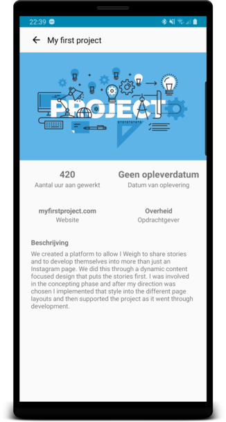

## Portfolio Android App

Trots op je eigen projecten? Sla ze op in de app en heb altijd jouw portfolio binnen handbereik!

## Wat bied de app?

- Al jouw projecten beheer je vanaf een eigen gebruikers account
- Bij het aanmaken van een project kan je extra gegevens aanvullen zoals:
    1. Een foto van het project
    2. Hoeveel uur je hebt gewerkt aan het project
    3. Wanneer de oplevering was
    4. Website link
    5. Naam van de opdrachtgever (indien van toepassing)
- Kan je een project niet vinden? Dan is er nog altijd de zoekfunctie
- Pas je project of gebruikersaccount aan
- Ook als je geen internet hebt kan je je projecten bekijken (maar niet alle functies zijn dan beschikbaar)

    
    

